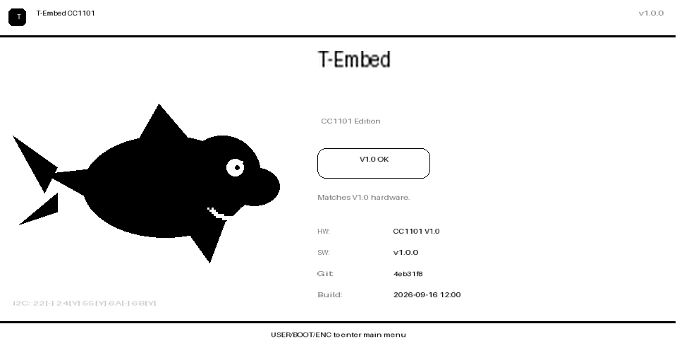
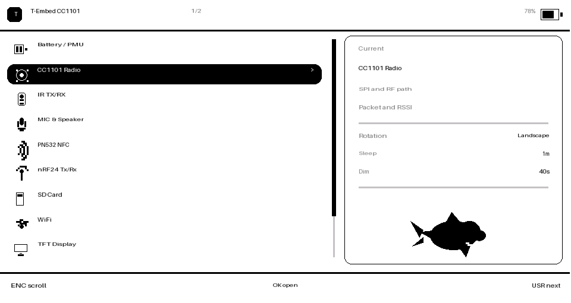

# Flipper-style Firmware for the LILYGO T-Embed CC1101

A Flipper Zero–inspired look for the stock `factory` firmware of the
[LILYGO T-Embed CC1101](https://github.com/Xinyuan-LilyGO/T-Embed-CC1101),
plus a one-click Windows updater in Flipper style.



## What it looks like

Monochrome white/black UI, the dolphin mascot, app icons, inverted selection
bars, top status bar with battery SOC and bottom button hints — the whole
factory test suite (Battery, CC1101, IR, Mic, NFC, nRF24, SD, WiFi, TFT,
WS2812, Settings) re-themed to feel like a Flipper.




## What's in this repo

| File | Purpose |
| --- | --- |
| `update.bat` | Flipper-styled updater: clones the upstream LILYGO repo if missing, pulls new sources, applies the theme, and can build + flash with PlatformIO. |
| `flipper-style.patch` | The theme itself (`examples/factory/flipper_style.h` + restyled UI files), applied to the local clone. |
| `previews/` | Renderings of the actual theme draw calls (menu page 1/2, startup). |

The upstream repository (~306 MB) is **not** vendored here — `update.bat`
clones it on demand and keeps it in sync.

## Usage (Windows)

1. Double-click `update.bat`.
2. It clones `Xinyuan-LilyGO/T-Embed-CC1101` next to itself (or pulls updates
   if you already cloned it), then applies `flipper-style.patch`.
3. When PlatformIO is installed (`pip install platformio`) it offers to build
   and then flash the `T_Embed_CC1101` environment over USB.

## Usage (manual / Linux)

```sh
git clone https://github.com/Xinyuan-LilyGO/T-Embed-CC1101.git
cd T-Embed-CC1101
git apply ../flipper-style.patch
pio run -e T_Embed_CC1101 -t upload
```

If a future upstream update conflicts with the patch, the updater uses
`git apply --3way` and falls back to the stock look with a warning if the
theme can no longer be applied cleanly.

## Note

`update.bat` never blocks on the theme: source updates always fast-forward;
the patch is only applied to your **working tree**, so upstream history stays
pristine and rebasable.
